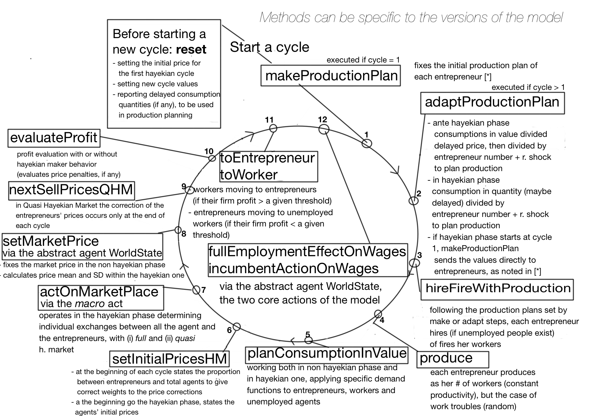

# Oligopoly

Marco Mazzoli, Matteo Morini, and Pietro Terna

The model and its construction are reported in [Oligopoly.pdf](Oligopoly.pdf).

A  concise presentation of the simulation mechanism is reported in the following
image:

We have also the [slides](slides_of_a_presentazione_of_the_model.pdf) of the presentation of the Oligopoly model at [WEHIA 2017](http://www.wehia2017.com).

A recent paper [(Business Cycle in a Macromodel with Oligopoly and Agents' Heterogeneity: An Agent-Based Approach, 2017)](http://rdcu.be/tlE6) of M.Mazzoli, M.Morini, and P.Terna, discusses the model and its results (if you experience problems in reading, please use Firefox). [Look at *Erratum* below].

The Oligopoly model uses [SLAPP](https://terna.github.io/SLAPP/) as its agent-based modeling shell.

______________________________________

*Erratum*: in Table 1, the **Expected employment ratio at t=1** is **0.9** and not 0.8.
